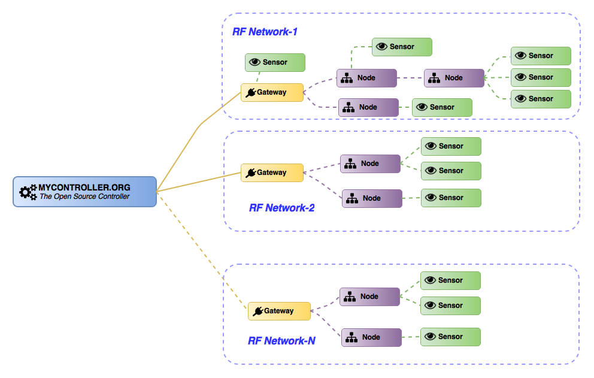

image::extra/images/logo-mycontroller.org_full.png[MyController.org, link="http://www.mycontroller.org"]
:source-language: java, angularjs

---

ifdef::env-github[]
image:https://badges.gitter.im/Join%20Chat.svg[link="https://gitter.im/mycontroller-org/mycontroller?utm_source=badge&utm_medium=badge&utm_campaign=pr-badge&utm_content=badge"]{nbsp}
image:https://www.paypalobjects.com/en_US/CH/i/btn/btn_donateCC_LG.gif[link="https://www.paypal.com/cgi-bin/webscr?cmd=_s-xclick&hosted_button_id=CHWAXCBVHTC64"]
endif::[]

[link=https://travis-ci.org/mycontroller-org/mycontroller]
Master: image:https://travis-ci.org/mycontroller-org/mycontroller.svg?branch=master["Build Status", link="https://travis-ci.org/mycontroller-org/mycontroller"]
[link=https://travis-ci.org/mycontroller-org/mycontroller]
Development: image:https://travis-ci.org/mycontroller-org/mycontroller.svg?branch=development["Build Status", link="https://travis-ci.org/mycontroller-org/mycontroller"]

====== Project website: http://www.mycontroller.org
====== Forum: http://forum.mycontroller.org
====== Want to try now? http://demo.mycontroller.org[Demo server] Authentication: demo/demo

== About

*MyController.org* is automation controller for home, office or any place.
Primarly this project started to support http://www.mysensors.org/[MySensors]. But later it expands support to other network also. Considered system resources in mind on development, as a outcome even we can run it on Raspberry PI (256 MB) very first model.

== Localization
MyController.org supports multiple languages. If you have interest to add/translate your native language for MyController.org send a request on https://www.transifex.com/mycontrollerorg/multi-locale/[Transifex MyController.org locale project]

== System Requirement

MyController.org is a very lightweight server, It required very less resource, believe me ;)

  * Disk        : ~30 MB (may require more space, when we store metrics data for long time)
  * Memory(RAM) : 100 MB
  * Java        : 1.8 or later

===== Supported Platforms (tested)
MyController.org is java based application server. We can run it in any platform where Java support is available.

- Linux
- Windows
- Raspberry PI (Oracle Java recommend)

== MyController and MySensors Setup



== Installation

====== Download(executable bundle),

* Visit MyController.org http://www.mycontroller.org/#/downloads[downloads page]

====== Configuration

Extract downloaded bundle where exactly do you want to run. Configuration files located in `mycontroller/conf`

File: `mycontroller.properties`

*Temporary file*
----
mcc.tmp.location=tmp/ # <1>
----
<1> You can change default location and file name. This file used as server temporery location. Used for the operation such as backup, restore, etc.,

*Database Configuration*
----
mcc.db.h2db.location=../conf/mycontroller # <1>
----
<1> You can change default location and file name. File will be stored with the file extension `.h2.db`. Do not add file extension.

*Web server configuration*
----
mcc.web.bind.address=0.0.0.0 # <1>
mcc.web.enable.https=true  # <2>
mcc.web.http.port=8443  # <3>
mcc.web.file.location=../www/  # <4>
mcc.web.ssl.keystore.file=../conf/keystore.jks  # <5>
mcc.web.ssl.keystore.password=mycontroller  # <5>
mcc.web.ssl.keystore.type=JKS  # <5>
----

<1> bind interface address. by default it will bind with all the available interface.
<2> Enable/disable https. Only one protocol supported at a time. true - `https`, false - `http`.
<3> Port number of `http/https` to access MyController.org server.
<4> web files location, no need to touch this one.
<5> If `https` is enabled these fields are mandatory.

Default URL: `https://<ip>:8443` (ex: `https://localhost:8443`)

NOTE: Default username/password: `admin/admin`

*Important*: Change default `mcc.web.ssl.keystore.file` and `mcc.web.ssl.keystore.password` and `https` protocol is
recommended

*MQTT broker configuration*
----
mcc.mqtt.broker.enable=true # <1>
mcc.mqtt.broker.bind.address=0.0.0.0 # <2>
mcc.mqtt.broker.port=1883 # <3>
mcc.mqtt.broker.websocket.port=7080 # <4>
mcc.mqtt.broker.persistent.store=../conf/moquette/moquette_store.mapdb # <5>
----

<1> Enable/disable inbuilt MQTT broker. by default it will be enabled. `true`- enabled, `false` - disabled
<2> bind interface address. by default it will bind with all the available interface.
<3> MQTT broker port
<4> websoicket port
<5> internal use. no need to touch this one.


*Logger configuration*

Configuration File Name: `logback.xml`

Default log file location: `logs/mycontroller.log`

====== Start/Stop Server
Executable scripts are located in `mycontroller/bin/`

* Linux
    - Start : `./start.sh`
    - Stop  : `./stop.sh`

* Windows
    - Start : Double click on `start.bat`
    - Stop  : `Ctrl+C`

* Other Platforms

```
java -Xms8m -Xmx100m -Dlogback.configurationFile=../conf/logback.xml -Dmc.conf.file=../conf/mycontroller.properties -cp "../lib/*" org.mycontroller.standalone.StartApp 
```
